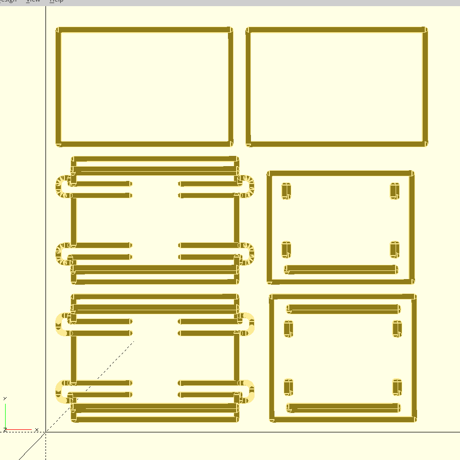
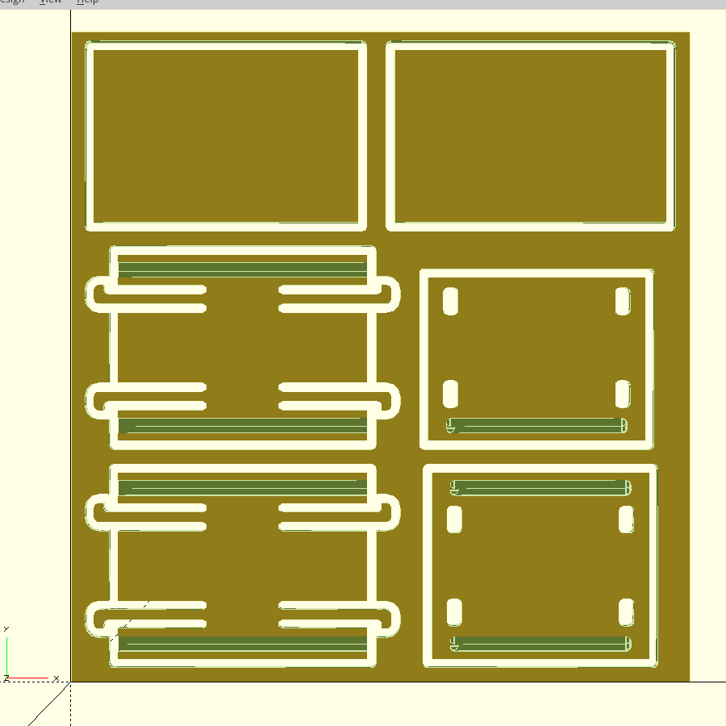
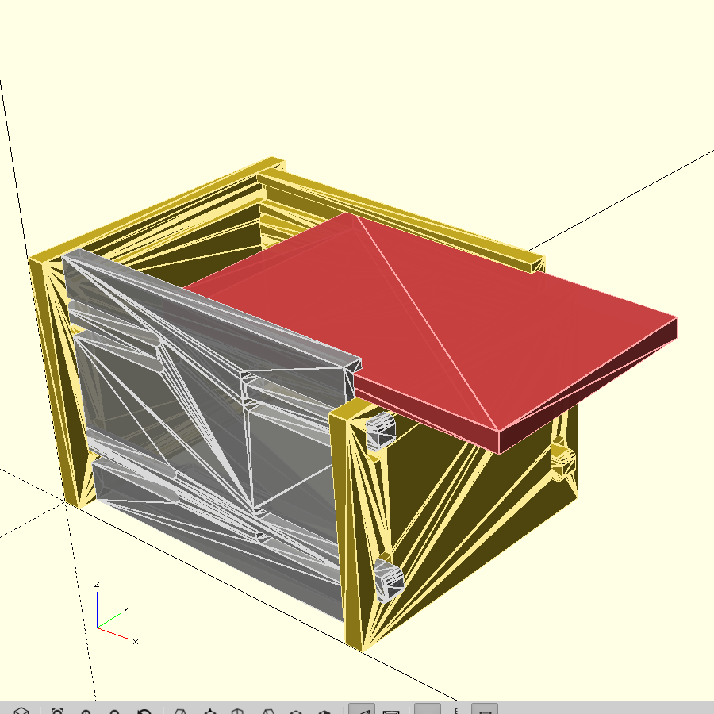
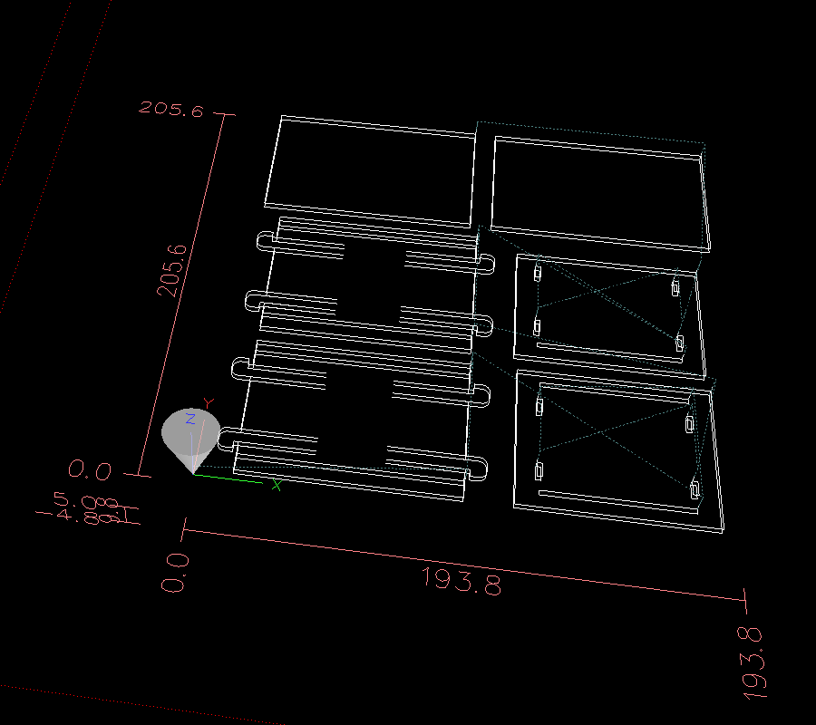
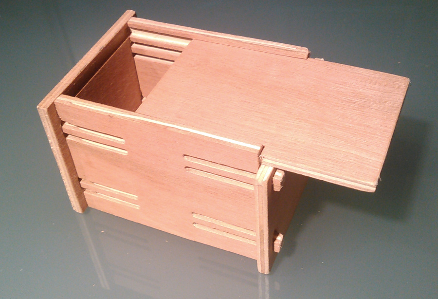

# Carving feature in OpenSCAD for CNC milling machine

# Overview

This carving feature explore an alternative way of making parts by *carving* them from a workpiece. The goal is to try to simplify the creation of parts for CNC milling machine and to render them as accurately as possible during design steps. As well, CNC milling has some specificities which would benefit to be integrated:
* The notion of workpiece of a specific material and size,
* Specific G-Code move operations to carve the workpiece or tool management like spindle speed, move speed or tool change,
* Multiple pass depending on material, cutting tool and CNC machine
* Multiple tools (drill-bits for drilling holes, end-mills with different diameter for carving, end-mills with head angle to mark folding lines, ...).

# Concept

This carving feature tries to follow natural step from a 'carving' point of view.

Design steps:

1. When creating and debugging a part, the View -> Carving -> "Render Milling Path" mode displays the volume traveled by the CNC milling tools following the programmed moves.

2. Once the parts is advanced enough, the View -> Carving -> "Render Carving Result" mode displays accurately the volume removed from the workpiece to carve the parts. Positions of the parts on the workpiece can be optimized.

3. Finally parts can be extracted from the workpiece using View -> Carving -> "Extract Parts for Assembly" mode. Once identified, *parts are extracted from the workpiece and assembled together* to render the final result. It is then possible to check how well the parts fit together.

4. *Export the parts into G-Code* via File -> Export -> "Export as NGC..." for manufacturing using LinuxCNC and CNC milling machine!

5. And... enjoy end result!

# Getting started

## Building OpenSCAD with carving feature

Follow [OpenSCAD build instructions](https://en.wikibooks.org/wiki/OpenSCAD_User_Manual/Building_OpenSCAD_from_Sources) and add CONFIG+="carving" to the qmake command. Example:

    $ qmake CONFIG+="experimental carving"
    $ make

The source code in located  in [src/carving](https://github.com/peberhard/openscad/tree/carving-plugin/src/carving) directory.

# Examples

Examples are availabe in [examples/](examples/) folder.

# Language extensions

In order to take into account carving specificies, new modules have been added to the language.

## Project Settings

### carving_settings()

Defines CNC Machine settings.

    carving_settings(tool_change_height, clearance_height);

**parameters:**

*   **tool_change_height** (required, no default value)

    Height in millimeter at which CNC shall move the tool (on Z axis) in order to change it (manual change of the tool).

*   **clearance_height** (default: 5mm)

    Height in millimeter at which CNC shall move the tool (on Z axis) in order to safely move quickly (on XY plan) from one milling position to another one.

**example:**

Set the tool change height to 35mm and use default clearance height:

    carving_settings(35);

### carving_tool()

Specifies required tools for the current project as well as its "tool number" in LinuxCNC tool table.

    carving_tool(tool_number, name, diameter);

**parameters:**

*   **tool_number** (required, no default value)

    Tool number in LinuxCNC tool table. It is used during generation of G-Code to identify when the tool shall be changed.
    When a tool change is detected, G-Code will be generated to move the tool to `tool_change_height` on Z axis before asking to change the tool.
    This is tipically required when multiple tools are used, for example a tool shall be used to drill holes and another one to mill a part.

*   **name** (required, no default value)

    Name used to identify this tool in OpenSCAD.

*   **diameter** (required, no default value)

    Diameter of the tool in millimeter. It is required in order to be able to carve the workpiece as realistically as possible to the end result of the real CNC.

**example:**

Add a 2.5mm drill bit, typically used to make thread for M3 screws:

    carving_tool(tool_number=2, name="T2", diameter=2.5);

Add a 3mm end-mill, typically used to mill material, like aluminium for example:

    carving_tool(1, "T1", 3);

### carving_tool_speed()

Specifies tool parameters for a specific material. Usually only one material is used hence only one line per tool is required.
However some projects could be carved in wood, aluminum, plexiglass, ... In this case it is possible to specify those tool parameters for each variation.

    carving_tool_speed(tool, material, spindle_speed, feedrate, step_down);

**parameters:**

*   **tool** (required, no default value)

    The tool name, as defined by `carving_tool()` module above.

*   **material** (required, no default value)

    Name to identify the material to be used for this project, example: "wood", "alu", ...

*   **spindle_speed** (required, no default value)

    Rotating speed in RPM (revolution per minute) of the specified tool on this specifc material.

*   **feedrate** (required, not default value)

    Speed in XY plan in millimeter per minute of the specified tool on this specifc material.

    Note: Z axis feedrate is derived from this value: Z axis feedrate = `feedrate` / 2.

*   **step_down**

    Thickness in millimeter of material which can be milled in one pass.
    Depending on end-mill and CNC, it is usually not possible to mill a material in one pass.
    For example we can use a 3mm end-mill to mill wood 2mm at a time, in this case step_down is set to 2. Then if the workpiece thickness is 5mm the milling will be done in 3 passes: 2 passes of 2mm then 1 pass of 1mm.

**example:**

Specifies that tool named "T1" can be used to carve the material named "wood" at the following spindle speed and feed rate.
Milling of the workpiece shall be done in passes of 2mm maximum.

    carving_tool_speed(tool="T1", material="wood", spindle_speed=7000, feedrate=400, step_down=2);

## Carving inside workpiece

The following modules are used to describes how to carve the workpiece.

### carving_workpiece()

Specifies the workpiece caraterisics.

carving_workpiece(v = [length, width],  material, thickness) { ... }

**parameters:*

*   **v = [length, width]** (required, no default value)

    length and width in millimeter of the workpiece the parts shall be carved from.

*   **material** (required, no default value)

    name of the material of this workpiece. At least one tool must be defined for this material with `carving_tool_speed()` module.

*   **thickness** (required, no default value)

**example:**

Defines a workpiece of wood of 200mm x 200mm with a thickness of 5mm:

    carving_workpiece([200, 200], "wood", thickness=5) {
        ...
    }

### carving_drill()

Drills a hole inside the workpiece at the specified position.
When exporting to G-Code, operations required to change the tool if required, move quickly to the position and drill (move down in Z axis) at the specified feed rate and spindle speed is generated.

    carving_drill(tool, v = [x, y], thickness);

**parameters:**

*   **tool** (required, no default value)

    The tool name which shall be used to make the hole. This tool caracterisics must be previously definied with `carving_tool_speed()` module for this material.

*   **v = [x, y]** (required, no default value)

    The position in millimeter in XY plan at which the hole shall be made.

*   **thickness** (optional, default: thickness of the workpiece)

    The thickness in millimeter of the hole to drill. If thickness is not specified, the hole will be of the thickness of the workpiece.

**example:**

Drills a hole trough the workpiece at the postion x = 10mm, y = 10mm.

    carving_drill("T2", [10, 10]);

### carving_path2d()

Milling operations are often done on a XY plan. This module and its chidren descibe the path on this XY plan that the end-mill tool shall follow.
When exporting in G-Code, the operations to change the tool if required, quickly move to the starting position and move down on the Z axis are generated.
If tool `step_down` value is lower than `thickness`, then this path will be automatically be performed in multiple passes (`thickness/step_down`) when exported in G-Code (see `step_down` definition).

    carving_path2d(tool, v = [x, y], id, pos, thickness) { ... }

**parameters:**

*   **tool** (required, no default value)

    The tool name which shall be used to make the hole. This tool caracterisics must be previously definied with `carving_tool_speed()` module for this material.

*   **v = [x, y]** (required, no default value)

    The starting position in millimeter of the path the end-mill tool shall follow.

*   **id** (optional, only required for assembly, no default value)

    For assembly mode:
    Parts must be identifed in the workpiece in order to make the assembly (Ex.: id = "front").
    The usage here is to attach the id of the part to path used to mill the outside of the part.

*   **pos = [pos_x, pos_y]** (optional, only required for assembly, default: [0, 0])

    For assembly mode: 
    When an id is specified, the default algorithm searches for the point in the workpiece which is the closest to "current position".
    This "current postion" is the position defined by the previous calls made to the `translate()` module before calling `carving_path2d()` module.
    If this position is not ideal, this algorithm might fail.
    In this case, it is possible to help this algorithm by specifing another point `pos` to start the seach of the closest point.

*   **thickness** (optional, default: thickness of the workpiece)

    The thickness in millimeter of the 2d path the end-mill tool shall follow. If thickness is not specified, then the thickness of the workpiece is used.

**example:**

Starts a path in the XY plan at position x = 10mm, y = 10mm. The thickness of the pass will be the thickness of the workpiece.

    carving_path2d("T1", [10, 10]) { ... }

### carving_line()

Specifes that the next move is a line from the current position to [x, y] position.
When exporting to G-Code, corresponding operation (G1) is generated.

    carving_line(v = [x, y]);

**parameters:**

*   **v = [x, y]**

    Position in millimeters to which the tool must move in a straight line.

**example:**

Move from the current position to the position x = 20, y = 10 in a straight line:

    carving_line([20, 20);

### carving_arc()

Specifies that the next move is an arc, from the current position to [x, y], and that the center of this arc is [i, j].
When exporting to G-Code, corresponding operation (G2 or G3) is generated.

    carving_arc(v = [x, y], center = [ i, j], ccw);

**parameters:**

*   **v = [x, y]** (required, no default value)

    The position in millimeter to which the arc move shall end.

*   **center = [ i, j]** required, no default value)

    Center of the arc in millimeter.

*  **ccw** (optional, default: false)

    Boolean to indicate if the movement is counter-clockwise. If not specified then the movement is assumed to be clockwise.
    If ccw = true, then the arc will be done in a counter-clockwise movement.

**example:**

Clockwise arc move of to x = 40, y = 10 with a center of i = 30, j = 10.

    carving_arc([40, 10], [ 30, 10]);

Counter-clockwise arc move of to x = 40, y = 10 with a center of i = 30, j = 10.

    carving_arc([40, 10], [ 30, 10], ccw = true);

### carving_reverse()

Changes the direction of a sub-section of a path. It module is used in specific cases, usually in conjunction with `mirror()` to reuse specifc path subsection like joins.

    carving_reverse() { ... }

**example:**

See [examples/clip_tenon_joint/](examples/clip_tenon_joint/) example.

## Assembly

### carving_assembly()

Root module containg assembly instructions.

    carving_assembly() { ... }

**example:**

See [examples/clip_tenon_joint/](examples/clip_tenon_joint/) example.

### carving_part(id)

Render the part previously identified by `id`' in `carving_path2d` module.

    carving_part(id);

**parameters:**

*   **id** (required, no default value)

    `id` specified by a previous call to `carving_path2d` module.

**example:**

Render the part identified as "front" at the current position (definied by previous call to the `translate()` module).

    carving_part("front");

As well, see [examples/clip_tenon_joint/](examples/clip_tenon_joint/) example.

