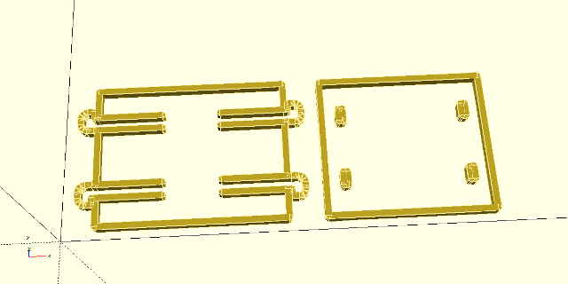
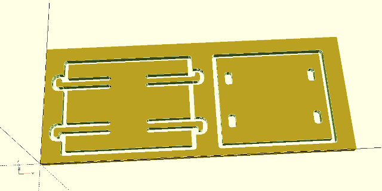
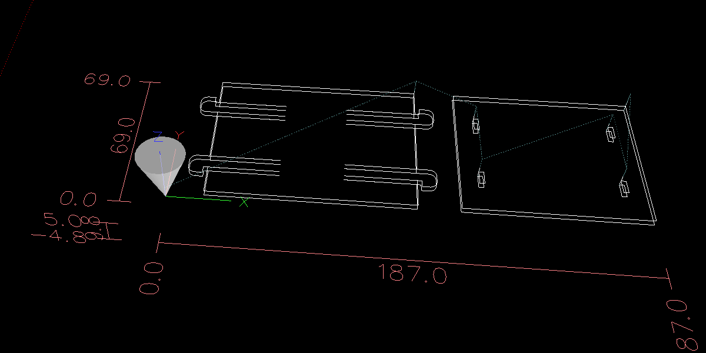
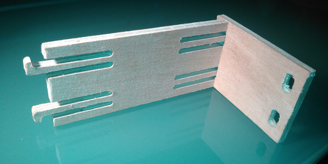
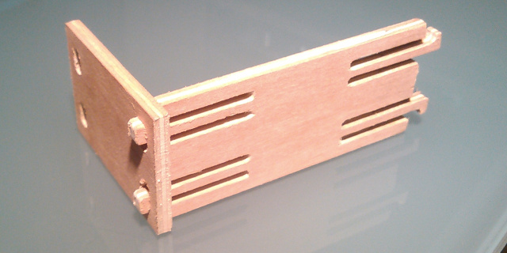

# Box clip tenon joint

Simple box assembled only with clip tenon joint only - no screw, no glue -.

## Milling Path

## Carving result

## Assembly of the parts

## G-Code in LinuxCNC

## End result

